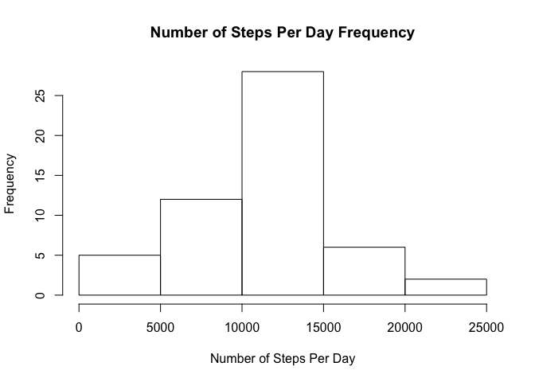
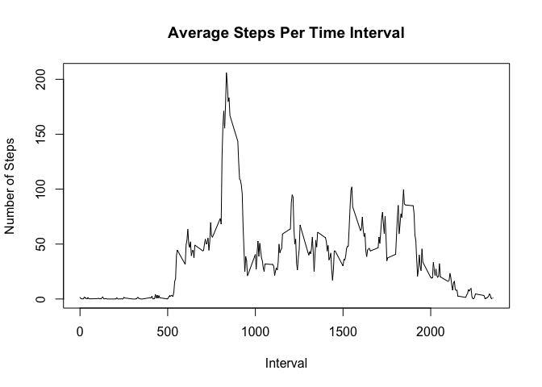
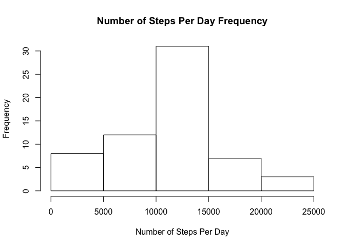
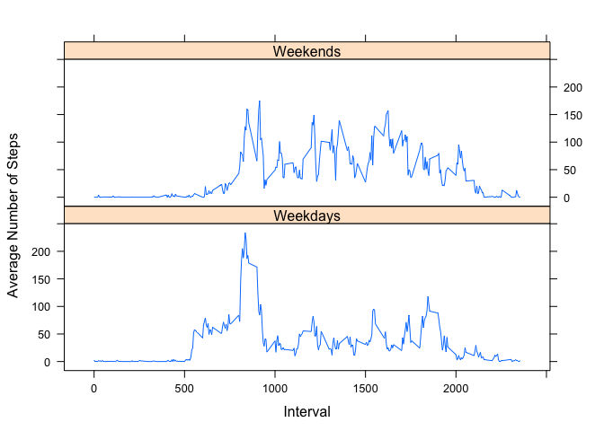

# Reproducible Research: Peer Assessment 1


## Loading and preprocessing the data

```r
activity_data <- read.csv("activity.csv")
summed_by_day <- ddply(activity_data, .(date), function(x) sum(x$steps))
avg_by_interval <- ddply(activity_data, .(interval), 
                         function(x) mean(x$steps, na.rm = T))

weekdays <- filter(activity_data, wday(date) != 1 & wday(date) != 7)
weekends <- filter(activity_data, wday(date) == 1 | wday(date) == 7)

avg_by_interval_weekday <- ddply(weekdays, .(interval), 
                         function(x) mean(x$steps, na.rm = T))
avg_by_interval_weekday <- mutate(avg_by_interval_weekday, 
                                  weekday = "Weekdays")

avg_by_interval_weekend <- ddply(weekends, .(interval), 
                         function(x) mean(x$steps, na.rm = T))
avg_by_interval_weekend <- mutate(avg_by_interval_weekend, 
                                  weekday = "Weekends")

weekend_data <- rbind.fill(avg_by_interval_weekend,
                           avg_by_interval_weekday)
```


## What is mean total number of steps taken per day?

<!-- -->


```r
mean_steps_day <- mean(summed_by_day$V1, na.rm = T)
median_steps_day <-  median(summed_by_day$V1, na.rm = T)
```

Mean Steps per day:   1.0766189\times 10^{4}

Median Steps per day: 10765


## What is the average daily activity pattern?
<!-- -->

Most Active Interval: 835

## Imputing missing values

```r
#find missing values
missings <- activity_data[is.na(activity_data$steps),]
missing_count <- nrow(missings)
merged <- merge(missings, avg_by_interval, by.x = "interval", by.y = "interval")

activity_data_imputed <- data.frame(activity_data)
activity_data_imputed[is.na(activity_data_imputed$steps),]$steps <- merged$V1

summed_by_day_imputed <- ddply(activity_data_imputed, .(date), 
                               function(x) sum(x$steps))

hist(summed_by_day_imputed$V1, 
     xlab = "Number of Steps Per Day", 
     main = "Number of Steps Per Day Frequency")
```

<!-- -->


```r
mean_steps_day_imputed <- mean(summed_by_day_imputed$V1)
median_steps_day_imputed <-  median(summed_by_day_imputed$V1)

mean_diff = (mean_steps_day - mean_steps_day_imputed)/ mean_steps_day
median_diff = (median_steps_day - median_steps_day_imputed)/ median_steps_day
```

Number of missing rows: 2304

Mean Steps per day:   1.0766189\times 10^{4}, 
Percentage Difference: 0

Median Steps per day: 1.1015\times 10^{4}, 
Percentage Difference: -0.0232234

## Are there differences in activity patterns between weekdays and weekends?

<!-- -->
